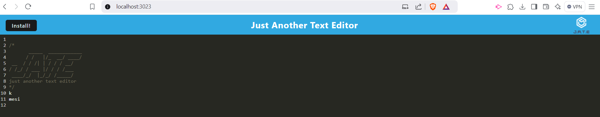

# 19 Progressive Web Applications (PWA): Text Editor

## Description
This project involves building a progressive web application (PWA) for a browser-based text editor. The application is a single-page application (SPA) that meets PWA criteria and includes offline functionality. It features data persistence techniques to ensure redundancy in case one storage method is unsupported by the browser. The application is built upon an existing codebase and incorporates methods for getting and storing data using `IndexedDB` with the `idb` package. 

The project demonstrates the practical application of modern web technologies, focusing on building reliable, fast, and offline-capable applications.

## Motivation
The motivation behind this project is to understand and implement core concepts of PWAs, such as offline functionality, browser compatibility, and data persistence. Building a text editor PWA offers an opportunity to work with IndexedDB, explore client-side storage options, and enhance user experience by ensuring the application runs seamlessly even without an internet connection.

## Purpose
The purpose of this project is to create a fully functional text editor that operates efficiently in any browser environment. By leveraging IndexedDB through the `idb` package, the application achieves robust data storage and retrieval capabilities. This project highlights the importance of redundancy and adaptability in application design, ensuring users can access and use the editor under various circumstances.

## Problem Solved
Traditional web applications often rely on constant internet connectivity, which can be a limitation for users. This project addresses that limitation by:
- Enabling offline functionality using service workers.
- Implementing IndexedDB to persist user data locally.
- Ensuring data redundancy by using multiple storage techniques.

Additionally, it provides a seamless user experience by supporting quick data retrieval and storage operations, making it suitable for real-time text editing needs.

## Lessons Learned
Through this project, I gained experience in:
- Setting up a PWA with offline functionality using service workers.
- Utilizing the `idb` package to interact with IndexedDB for data storage and retrieval.
- Implementing SPA architecture to enhance user experience.
- Managing data persistence and redundancy for maximum compatibility.
- Deploying the application to ensure accessibility and usability across different environments.

## Table of Contents
- [Installation](#installation)
- [Usage](#usage)
- [Credits](#credits)
- [License](#license)
- [Features](#features)
- [How to Contribute](#how-to-contribute)
- [Tests](#tests)

## video
   ```bash
   https://one9-text-editor-phor.onrender.com

   ```

## Installation
To set up this project on your local machine, follow these steps:


1. Clone the repository to your local machine:
   ```bash
   git clone https://github.com/danielsantana9824/19-Text-Editor
   ```
2. Navigate to the project directory:
   ```bash
   cd text-editor-pwa
   ```
3. Install the required dependencies:
   ```bash
   npm install
   ```
4. Build the application:
   ```bash
   npm run build
   ```
5. Start the application:
   ```bash
   npm start
   ```

## Usage
Once the application is running, you can access it in your browser. The main features include:
- Editing and saving text in the browser.
- Automatic data persistence using IndexedDB.
- Offline functionality, ensuring the editor is available even without an internet connection.

### Example Screenshot


## Credits
This project builds upon concepts and starter code provided during the course. The `idb` package, developed by Google and Mozilla, was used for IndexedDB interactions. 

## License
This project is licensed under the MIT License. For more information about licenses, please refer to [Choose a License](https://choosealicense.com/).

## Features
- Browser-based text editor with real-time saving.
- Offline functionality enabled by service workers.
- Data persistence using IndexedDB and the `idb` package.
- SPA architecture for a seamless user experience.

## How to Contribute
If you would like to contribute to this project, please fork the repository and submit pull requests. Ensure that you adhere to coding standards and provide meaningful descriptions for your changes.

Refer to the [Contributor Covenant](https://www.contributor-covenant.org/) for contribution guidelines.

## Tests
To run tests for this application, use the following command:
```bash
npm run test
```

Ensure you have set up the testing environment properly and include any additional instructions here if required.
